# 961. N-Repeated Element in Size 2N Array
Challenge available at: https://leetcode.com/problems/n-repeated-element-in-size-2n-array/description/

## Intuition
<!-- Describe your first thoughts on how to solve this problem. -->
My first thought was to use a HashMap:
```rust []
use std::collections::HashMap;
impl Solution {
    pub fn repeated_n_times(nums: Vec<i32>) -> i32 {
        let mut seq: HashMap<i32, i32> = HashMap::new();

        for &x in nums.iter() {
            if let Some(_) = seq.get(&x) {
                return x;
            } else {
                seq.insert(x, 1);
            }
        }
        0
    }
}
```
The runtime beats only 20% in leetcode.

After analysing the problem I realize that: Or the first 4 elements in the array will have a repetition or the array must have two identical neighbors, so I implemented like that:
```rust []
impl Solution {
    pub fn repeated_n_times_best(nums: Vec<i32>) -> i32 {
        if (nums[0] == nums[2]) || (nums[0] == nums[3]) {
            return nums[0];
        } else if nums[1] == nums[3] {
            return nums[1];
        }

        let mut iter = nums.windows(2);
        while let Some(x) = iter.next() {
            if x[0] == x[1] {
                return x[0];
            }
        }

        0
    }
}
```
The runtime beats 100% in leetcode.

## Approach
<!-- Describe your approach to solving the problem. -->
For the parallel aproach the first implementation was starting the best aproach:
```rust []
impl Solution {
    pub fn repeated_2_times(nums: Vec<i32>) -> i32 {
        if nums.len() > 2 {
            let mut iter = nums.into_iter();
            let rx = iter.next().unwrap();
            let ry = iter.next().unwrap();
            let (ra, rb) = rayon::join(
                || {
                    if rx == ry { rx } else { 0 }
                },
                || {
                    repeated_2_times(iter.collect())
                }
            );
            return ra | rb;
        }
        return 0;
    }
    pub fn repeated_n_times_par(nums: Vec<i32>) -> i32 {
        let r = repeated_2_times(nums.clone());
        if r == 0 {
            if (nums[0] == nums[2]) || (nums[0] == nums[3]) {
                return nums[0];
            } else if nums[1] == nums[3] {
                return nums[1];
            }
        }
        return r;
    }
}
```
But this code raise a stack overflow exception.

After I implemented a block approach:
```rust []
impl Solution {
    pub fn repeated_2_times(nums: &[i32]) -> i32 {
        if nums.len() >= 2 {
            let mut iter = nums.into_iter();
            let rx = *iter.next().unwrap();
            let ry = *iter.next().unwrap();
            let (ra, rb) = rayon::join(
                || {
                    if rx == ry { rx } else { 0 }
                },
                || {
                    repeated_2_times(iter.as_slice())
                }
            );
            return ra | rb;
        }
        return 0;
    }

    pub fn repeated_n_times_par(nums: Vec<i32>) -> i32 {

        if (nums[0] == nums[2]) || (nums[0] == nums[3]) {
            return nums[0];
        } else if nums[1] == nums[3] {
            return nums[1];
        }

        let mut wanted_size = 2;
        let mut remaining_nums:&[i32] = nums.as_slice();
        let mut blocks = std::iter::from_fn(|| {
            if remaining_nums.is_empty() {
                None
            } else {
                let block_size = remaining_nums.len().min(wanted_size);
                let (block, remains) = remaining_nums.split_at(block_size);
                remaining_nums = remains;
                wanted_size = wanted_size*2;
                Some(block)
            }
        });
        while let Some(chunk) = blocks.next() {
            let r: i32 = repeated_2_times(chunk);
            if r != 0 {
                return r;
            }
        }
        0
    }
}
```

This implementation still not stack safe yet, but accept vectors until the maximun size defined by the challenge: `0 <= nums[i] <= 104`.


A stack safe implementation is the following:

## Complexity



- Time complexity:
<!-- Add your time complexity here, e.g. $$O(n)$$ -->

- Space complexity:
<!-- Add your space complexity here, e.g. $$O(n)$$ -->

## Results
